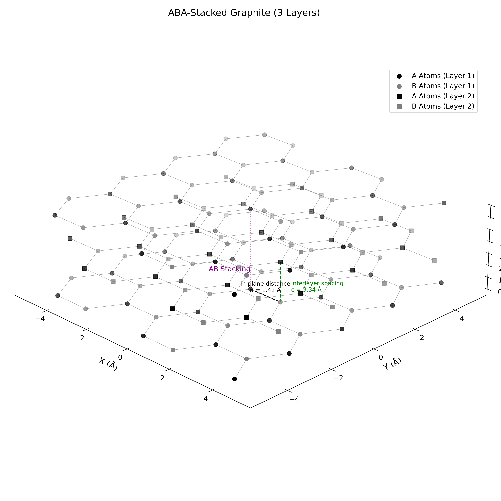
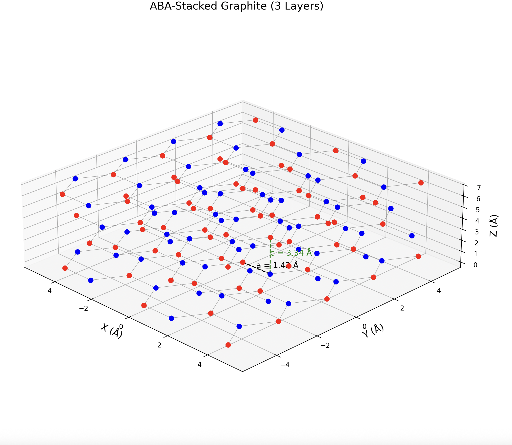

## Graphite Lattice Visualization

This project generates a three-dimensional visualization of the crystal structure of graphite using Python. The model constructs an ABA-stacked arrangement of graphene layers from lattice vectors and basis atoms, reproducing the characteristic layered hexagonal structure of graphite. The visualization highlights both in-plane bonding and interlayer stacking, providing an intuitive representation of graphite's crystallographic geometry.

#### Features

* Hexagonal graphene lattice generation
* ABA stacking sequence implementation
* Nearest-neighbor bond visualization
* Interlayer spacing representation
* Three-dimensional crystal structure rendering
* Interactive visualization using Matplotlib

#### Physical Background

Graphite is a layered carbon allotrope composed of stacked graphene sheets arranged in an ABA (Bernal) stacking configuration. While strong covalent bonds connect carbon atoms within each layer, weaker interlayer interactions give rise to graphite's anisotropic physical properties. This project reconstructs the crystal structure from lattice vectors and atomic basis positions, illustrating the geometric arrangement responsible for many of graphite's electronic and mechanical characteristics.

#### Visualization

*ABA-Stacked Graphite Structure*

The figure shows multiple graphene layers arranged in the characteristic ABA stacking sequence. Carbon atoms are connected through nearest-neighbor bonds within each layer, while the vertical separation between layers highlights the three-dimensional nature of the crystal.

#### Author

Silvia Barnes

*Undergraduate Computational Physics Project*
